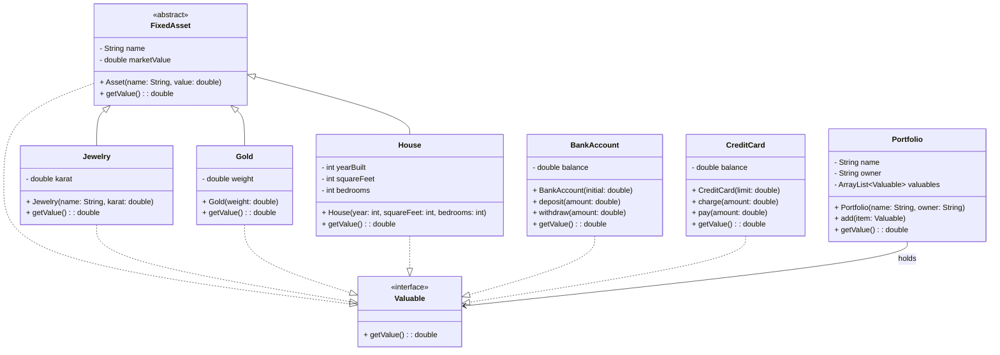

```mermaid
classDiagram

class Valuable {
    <<interface>>
    + getValue(): double
}

class Portfolio {
    - String name
    - String owner
    - ArrayList~Valuable~ valuables
    + Portfolio(name: String, owner: String)
    + add(item: Valuable)
    + getValue(): double
}

class FixedAsset {
    <<abstract>>
    - String name
    - double marketValue
    + Asset(name: String, value: double)
    + getValue(): double
}

class Jewelry {
    - double karat
    + Jewelry(name: String, karat: double)
    + getValue(): double
}

class Gold {
    - double weight
    + Gold(weight: double)
    + getValue(): double
}

class House {
    - int yearBuilt
    - int squareFeet
    - int bedrooms
    + House(year: int, squareFeet: int, bedrooms: int)
    + getValue(): double
}

class BankAccount {
    - double balance
    + BankAccount(initial: double)
    + deposit(amount: double)
    + withdraw(amount: double)
    + getValue(): double
}

class CreditCard {
    - double balance
    + CreditCard(limit: double)
    + charge(amount: double)
    + pay(amount: double)
    + getValue(): double
}

FixedAsset <|-- Jewelry
FixedAsset <|-- Gold
FixedAsset <|-- House
FixedAsset ..|> Valuable
Jewelry ..|> Valuable
Gold ..|> Valuable
House ..|> Valuable
BankAccount ..|> Valuable
CreditCard ..|> Valuable
Portfolio --> Valuable : holds
```
