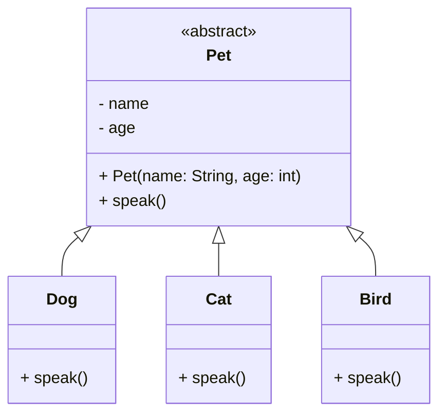

```mermaid
classDiagram
    class Pet {
    <<abstract>>
     - name
     - age
     + Pet(name: String, age: int)
     + speak()
    }
    class Dog{
      + speak()
    }
     class Cat{
      + speak()
    }
     class Bird{
      + speak()
    }

      Pet <|-- Dog
      Pet <|-- Cat
      Pet <|-- Bird
```